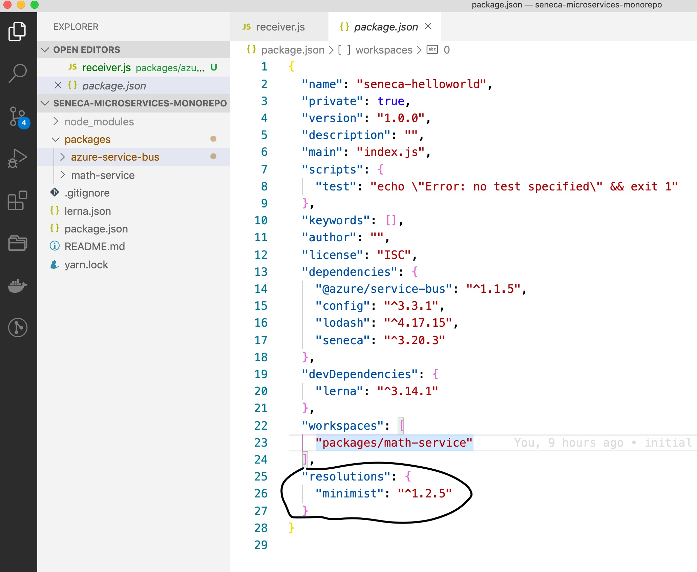

# A Mono Repo for Seneca Micro Services

## Pre-requisite

- Install Lerna globally and initailize lerna.

  ```
  npm install -g lerna

  lerna init
  ```

- Configure lerna to use yarn as npmClient.

- Setup Yarn Workspaces. (instruction are @ link below)

  https://classic.yarnpkg.com/en/docs/workspaces/

- Use selective depencency resolution if required.

Refer: https://classic.yarnpkg.com/en/docs/selective-version-resolutions/


